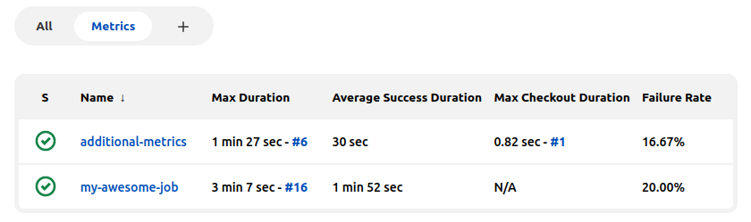

Additional Metrics Plugin
=========================

[](https://github.com/jenkinsci/additional-metrics-plugin/releases/latest)
[](https://plugins.jenkins.io/additional-metrics)
[](https://ci.jenkins.io/job/Plugins/job/additional-metrics-plugin/job/master/)
[](https://ci.jenkins.io/job/Plugins/job/additional-metrics-plugin/job/master)
[](https://ci.jenkins.io/job/Plugins/job/additional-metrics-plugin/job/master)

[](https://github.com/jenkinsci/additional-metrics-plugin/blob/master/LICENSE)

Provides additional metrics via columns in Jenkins' List View.

### Provided Metrics
- Minimum, Maximum, Average, and Standard Deviation build times for all, or only successful builds.
- Minimum, Maximum, and Average checkout times for Pipeline builds.
- Success, Failure, and Unstable rates.
- Success and Failure time rates (ie Uptime and Downtime).



### REST API
All provided metrics are also exposed in the Job's REST API as a job Action.

#### Examples

##### Single Job

###### JSON
There is no filtering in JSON tree that I am aware of. Nevertheless, you can still do:
```
<JENKINS_URL>/api/json?depth=3&tree=jobs[fullName,actions[jobMetrics[*]]]
```
And then do the filtering post execution. You may need to adjust the depth, depending on how deeply nested your project is.

###### XML
Using XPath, it is possible to get the metrics for one project. You may need to adjust the depth, depending on how deeply nested your project is.
```
<JENKINS_URL>/api/xml?depth=4&xpath=(//job[fullName='github/repo1/master']/action/jobMetrics[node()])[1]
```

```
<?xml version="1.0" encoding="UTF-8"?>
<jobMetrics>
   <avgCheckoutDuration>0</avgCheckoutDuration>
   <avgDuration>446</avgDuration>
   <avgSuccessDuration>240</avgSuccessDuration>
   <failureRate>0.125</failureRate>
   <failureTimeRate>0.00000711702773729547-5</failureTimeRate>
   <maxCheckoutDuration>0</maxCheckoutDuration>
   <maxDuration>3024</maxDuration>
   <maxSuccessDuration>1961</maxSuccessDuration>
   <minCheckoutDuration>0</minCheckoutDuration>
   <minDuration>45</minDuration>
   <minSuccessDuration>45</minSuccessDuration>
   <standardDeviationDuration>819</standardDeviationDuration>
   <standardDeviationSuccessDuration>493</standardDeviationSuccessDuration>
   <successRate>0.875</successRate>
   <successTimeRate>0.9999928829722644</successTimeRate>
   <unstableRate>0.875</unstableRate>
</jobMetrics>
```

##### List View / [Build Monitor View](https://plugins.jenkins.io/build-monitor-plugin)
Assuming the view name is `MyView`,
```
<JENKINS_URL>/view/MyView/api/json?tree=jobs[fullName,actions[jobMetrics[*]]]
```

You will get an output similar to the below (modified for clarity):

```
{
  "_class": "com.smartcodeltd.jenkinsci.plugins.buildmonitor.BuildMonitorView",
  "jobs": [
    {
      "_class": "org.jenkinsci.plugins.workflow.job.WorkflowJob",
      "actions": [
        {
          "_class": "org.jenkinsci.plugins.additionalmetrics.MetricsActionFactory$MetricsAction",
          "jobMetrics": {
            "avgCheckoutDuration": 19581,
            "avgDuration": 2641447,
            "avgSuccessDuration": 394148,
            "failureRate": 0.75,
            "failureTimeRate": 0.09493349090072016,
            "maxCheckoutDuration": 24734,
            "maxDuration": 3439386,
            "maxSuccessDuration": 394148,
            "minCheckoutDuration": 8226,
            "minDuration": 394148,
            "minSuccessDuration": 394148,
	    "standardDeviationDuration": 42447,
            "standardDeviationSuccessDuration": 71238,
            "successRate": 0.25,
            "successTimeRate": 0.9050665090992799, 
            "unstableRate": 0
          }
        }
      ],
      "fullName": "github/repo1/master"
    },
    {
      "_class": "org.jenkinsci.plugins.workflow.job.WorkflowJob",
      "actions": [
        {
          "_class": "org.jenkinsci.plugins.additionalmetrics.MetricsActionFactory$MetricsAction",
          "jobMetrics": {
            "avgCheckoutDuration": 34089,
            "avgDuration": 316825,
            "avgSuccessDuration": 316825,
            "failureRate": 0,
            "failureTimeRate": 0,
            "maxCheckoutDuration": 43413,
            "maxDuration": 443877,
            "maxSuccessDuration": 443877,
            "minCheckoutDuration": 24766,
            "minDuration": 189773,
            "minSuccessDuration": 189773,
	    "standardDeviationDuration": 8089,
	    "standardDeviationSuccessDuration": 3014,
            "successRate": 1,
            "successTimeRate": 1, 
            "unstableRate": 0
          }
        }
      ],
      "fullName": "github/repo2/master"
    }
  ]
}
```